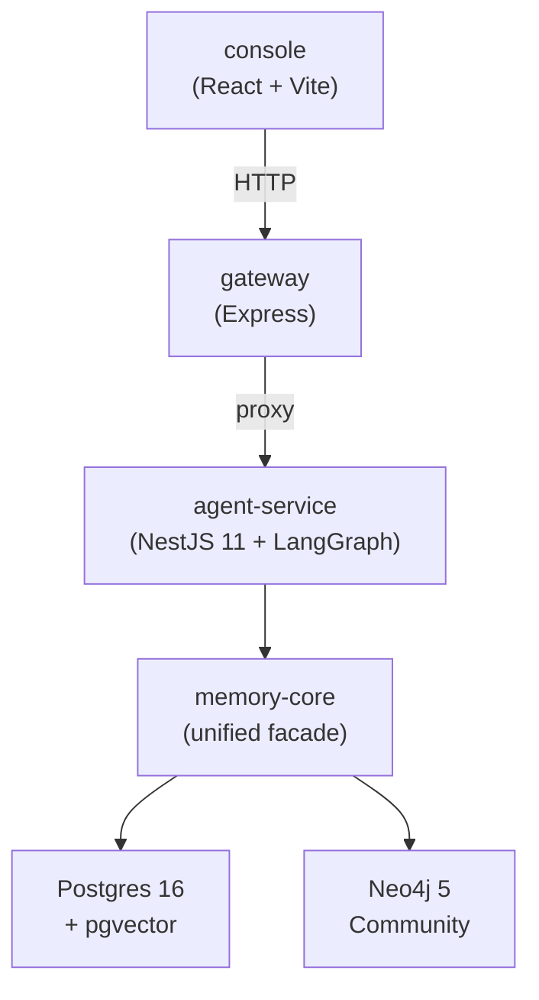
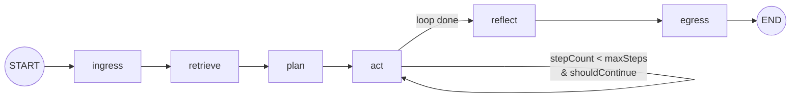
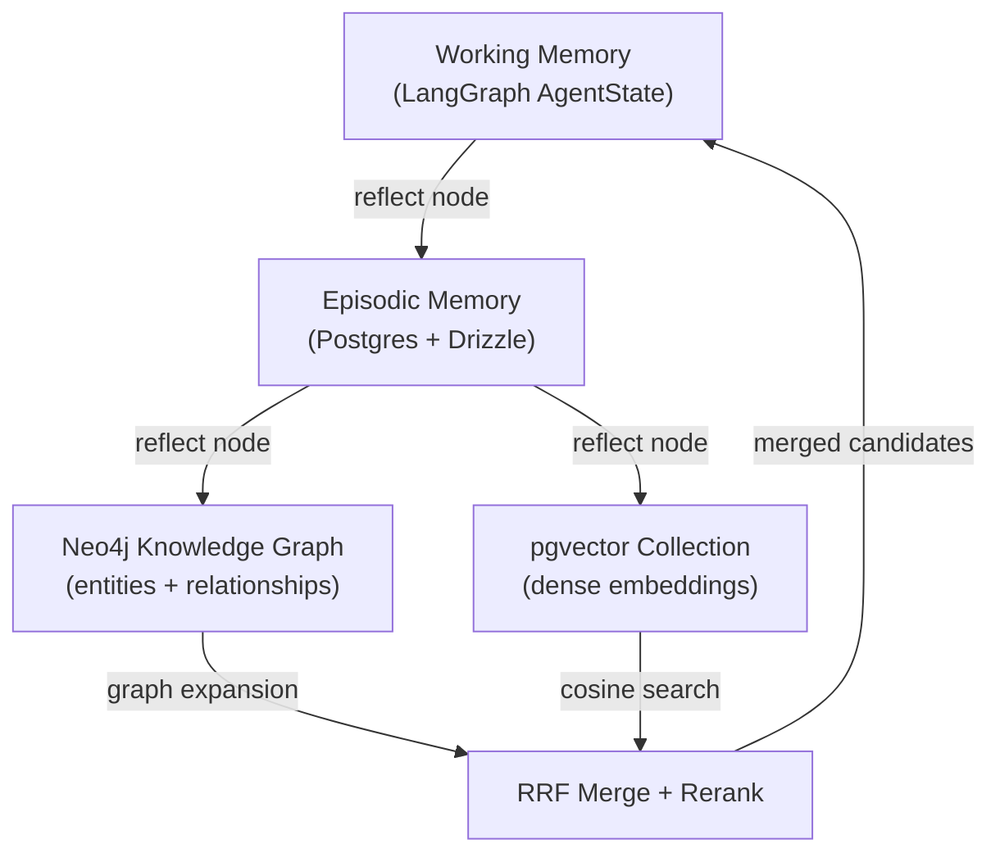

# agent-native-monorepo


> A production-grade chassis for stateful LangGraph agents, purpose-built for multi-agent development workflows.

A Yarn 4 monorepo containing a NestJS 11 microservice that runs a LangGraph state machine designed around a **Three-Brain memory architecture**: per-run Working Memory, session-scoped Episodic Memory (Postgres + Drizzle ORM), and long-term Semantic Memory combining a Neo4j 5 knowledge graph with pgvector dense embeddings. This project demonstrates the intersection of senior monorepo engineering and production agentic systems: it is an extraction of production patterns from a proprietary platform, sanitized for public consumption.

> **What is wired, and what is not.** The graph runs and the working-memory tier is live;
> the episodic and semantic adapters are tested but not yet constructed by the service.
> [`docs/STATUS.md`](docs/STATUS.md) is the per-capability matrix, and it is the file to
> trust when this README and the code disagree.

---

## Architecture

### System Overview



### LangGraph Node Graph



### Three-Brain Memory Model



---

## Why This Exists

This repository is an extraction of production patterns from a proprietary agentic platform, sanitized for public consumption. It is **not** a tutorial, starter kit, or SaaS template.

It exists to demonstrate architectural thinking in two domains that rarely overlap:

1. **Senior monorepo engineering** — Yarn 4 workspaces, Turborepo build orchestration, shared TypeScript configs, and Zod schemas as the single source of truth for every type that crosses a package boundary.
2. **Production agentic systems** — LangGraph state machines, hybrid symbolic + dense memory retrieval via Neo4j and pgvector, OpenTelemetry instrumentation at the graph-node level.

Not everything in the second list is wired into the request path yet. The retrieval and
memory adapters are built and tested; connecting them to the service is P2-A. See
[`docs/STATUS.md`](docs/STATUS.md) before quoting this section back at the code.

The agent's domain logic is intentionally trivial (a single system prompt: _"You are a helpful research assistant."_). The value is in the chassis — how the pieces connect, how memory is structured, how observability is wired, and how the monorepo scales.

---

## Quickstart

```bash
git clone https://github.com/<owner>/agent-native-monorepo
cd agent-native-monorepo
yarn install
docker compose up -d    # Postgres + pgvector, Neo4j
yarn dev                # Starts all services in dev mode

# Request/response mode
curl -X POST http://localhost:3001/runs \
  -H 'Content-Type: application/json' \
  -d '{"sessionId": "550e8400-e29b-41d4-a716-446655440000", "messages": [{"role": "user", "content": "What is LangGraph?"}]}'

# Streaming mode (SSE)
curl -N -X POST http://localhost:3001/runs/stream \
  -H 'Content-Type: application/json' \
  -d '{"sessionId": "550e8400-e29b-41d4-a716-446655440000", "messages": [{"role": "user", "content": "What is LangGraph?"}]}'
```

### Prerequisites

- Node.js 24.x (not required for [Full-Stack Docker](#full-stack-docker))
- Docker and Docker Compose

Both quickstart curls above work against a fresh clone with no `.env` at all: with no
`GOOGLE_API_KEY` set, the service runs the graph against a deterministic stub dependency
set, which is also what CI exercises.

> **Setting `GOOGLE_API_KEY` currently breaks `POST /runs`.** The live dependency set
> embeds with `text-embedding-004`, which is retired, so the run fails with a 500. The
> replacement model changes the embedding dimension, and 768 is hardcoded in three places,
> so the fix is part of P2-A rather than a one-line swap. Tracked as row 16 in
> [`docs/STATUS.md`](docs/STATUS.md).

Copy `.env.example` to `.env` if you want to point the service at your own infrastructure:

```bash
cp .env.example .env
```

### Full-Stack Docker

To run the entire stack (infra + all apps) in Docker without Node.js installed:

```bash
docker compose --profile full up --build
```

| Service       | URL                   |
| ------------- | --------------------- |
| Console       | http://localhost:8080 |
| Gateway       | http://localhost:3001 |
| Agent Service | http://localhost:3000 |
| Neo4j Browser | http://localhost:7474 |

`docker compose up` (without `--profile`) still starts only the infrastructure services for local `yarn dev` development.

---

## Three-Brain Memory

The memory system is designed as three tiers with distinct scopes, persistence strategies, and access patterns. Working Memory is live. The other two are implemented in `packages/memory-core`, covered by integration tests against real Postgres and Neo4j, and not yet constructed by `apps/agent-service` — the service passes the graph a no-op writer and an empty retriever. Per-capability detail is in [`docs/STATUS.md`](docs/STATUS.md); the wiring is P2-A.

### Working Memory

Per-run, in-process state held in the LangGraph `AgentState` object. Accumulates intermediate reasoning, tool outputs, and retrieved context. Destroyed at run completion — no external I/O.

### Episodic Memory

Session-scoped turn history persisted in Postgres via Drizzle ORM. Records the full conversation per `session_id`. Serves as raw material for Semantic tier promotion.

Retention is unbounded: there is no expiry column and no cleanup job. The `reflect` node writes each turn with a plain `INSERT`, so a replayed run duplicates its rows — the idempotency the tier needs is a natural key it does not yet have.

### Semantic Memory (Hybrid)

> **This is the intended architectural differentiator.** Long-term memory is designed to span two complementary indices, both written by the `reflect` node.

The `reflect` node writes Postgres, then Neo4j, then pgvector, in three sequential loops. Each individual write is replay-safe — Cypher `MERGE`, and pgvector upsert on a content hash — but the three are not atomic together, and a crash between them leaves the indices disagreeing. Making that write one unit is P2-A.

| Index            | Technology | What It Stores                                   | Retrieval Pattern                    |
| ---------------- | ---------- | ------------------------------------------------ | ------------------------------------ |
| Knowledge Graph  | Neo4j 5    | Entities (`:Concept`, `:Fact`) and relationships | Bounded multi-hop Cypher traversal   |
| Dense Embeddings | pgvector   | Distilled fact embeddings (768-dim)              | Cosine similarity via `<=>` operator |

**Why both?** Dense search finds semantically similar facts (paraphrase, synonym variants) but cannot follow relational chains. Graph traversal follows explicit relationships (A→B→C) but misses paraphrase variants. Together, they provide complementary recall paths that reduce false negatives. The reasoning is recorded in [ADR 0002](docs/adr/0002-neo4j-and-pgvector-rather-than-one-store.md), which also notes that the premise is unmeasured until P2-B builds the ablation.

Results are intended to merge via **Reciprocal Rank Fusion (RRF)**. `rrfMerge` is implemented and unit-tested, but its fusion key is `entityId ?? content`, and Neo4j candidates always carry an `entityId` while pgvector candidates never do — so the two lists key differently, no score is ever summed, and the current behaviour is interleaving rather than fusion. P2-A fixes the key; until then, treat the RRF claim as a design, not a result.

---

## LangGraph Node Reference

| Node       | Purpose                         | Key Input Fields               | Key Output Fields            | Side Effects                              |
| ---------- | ------------------------------- | ------------------------------ | ---------------------------- | ----------------------------------------- |
| `ingress`  | Validate request, seed state    | Raw HTTP body                  | Full `AgentState`            | None                                      |
| `retrieve` | Hybrid semantic recall          | `messages`                     | `retrievedContext`           | _(none yet — see `docs/STATUS.md` row 1)_ |
| `plan`     | LLM planning step               | `messages`, `retrievedContext` | `currentPlan`, `tokenCounts` | LLM API call                              |
| `act`      | Tool execution loop             | `currentPlan`                  | `toolOutputs`, `stepCount`   | Tool invocations                          |
| `reflect`  | Memory consolidation            | Full state                     | _(none — side-effect node)_  | _(none yet — see `docs/STATUS.md` row 1)_ |
| `egress`   | Validate output, build response | Full state                     | `outcome`                    | None                                      |

---

## Contributing

1. Fork the repository and create a feature branch.
2. Read `.context/conventions.md` for code style and naming rules, and `docs/STATUS.md`
   before adding a sentence that describes what the system does.
3. For non-trivial work, start with a PRD — see `docs/prd/README.md` for the backlog and
   `.context/workflows.md` for the flow. Decisions are recorded in `docs/adr/`.
4. Follow the step-by-step guides in `.context/workflows.md` for:
   - Adding a new graph node
   - Adding a new package
   - Adding a new memory adapter
5. Use the specialized subagent prompts in `.agents/` if working with AI coding tools.
6. See `AGENTS.md` for cross-tool compatibility notes (Cursor, Kilo Code, Continue, Aider).
7. Run `yarn turbo typecheck && yarn turbo lint` before submitting a PR.
8. Use Conventional Commits: `feat:`, `fix:`, `chore:`, `test:`, `docs:`, `ci:`.
